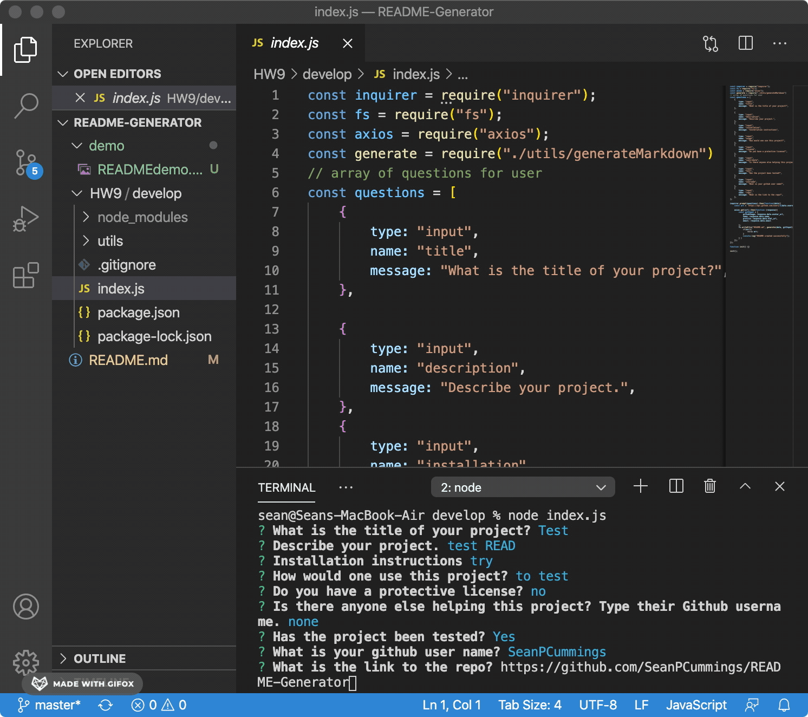

# README-Generator

Above is a simple README file being created through command line prompts using inqurier. 
This allows for the quick write ups of READMEs for projects that dont have the time to
think about formatting and organizing a table of contents. 

The coding wasn't too much of a problem, my biggest hurdle was getting the demo gif
the right size, length and to show properly. 
